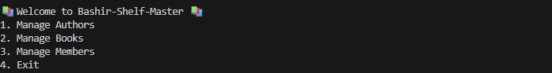

# Bashir-Shelf-Master 📚

Bashir-Shelf-Master is a command-line interface (CLI) library management system built with **Python** and **SQLAlchemy**. It allows users to manage authors, books, and members, and also supports borrowing and returning books.

---

## Features

### Author Management
- List all authors
- Add new authors
- Search authors by name

### Book Management
- List all books with author information
- Add new books
- Search books by title
- Delete books

### Member Management
- Register as a member
- List all members
- Borrow books
- Return books

### Borrowing System
- Track which books are borrowed and by whom
- Ensure books are only borrowed if available
- Update book status upon borrowing/returning

---

## Technologies Used

- Python
- SQLAlchemy ORM
- SQLite (default database)
- `datetime` module for timestamps

---

## Project Structure

```
Bashir-Shelf-Master/
│
├── .venv/
├── assets
├── lib/
│ └── db/
│       ├──__pycache__/
│       ├──__init__.py
│       ├── app.db  
│       ├── database.py
│       ├── models.py
│       └── seed.py  
│ ├── __init__.py
│ ├── cli.py
│ ├── helpers.py
│ ├── debug.py
├── migrations/
│ ├── __pycache__
│ ├── version/  
│ ├── env.py
│ ├── README
│ └── script.py.mako  
├── alembic.ini
├── Pipfile
├── Pipfile.lock
└── README.md
```
---


## Getting Started

### Prerequisites
- Python
- `pipenv` for dependencies

### Installation

1. Clone the repository:
   ```bash
   git clone https://github.com/Jimmy-wq-code/Bashir-Shelf-Master
   cd Bashir-Shelf-Master
   ```

2. Install dependencies using Pipenv:

    ```
    pipenv install
    pipenv shell
    ```


3. Seed the database:
    ```
    python lib/db/seed.py
    ```

4. Run the CLI:
    ```
    python lib/cli.py
    ```

### Usage

- Navigate the menus by typing the number corresponding to your choice.

- Authors and books must be added before they can be associated with borrow records.

- Members must be registered before borrowing books.

- Borrowed books cannot be borrowed again until returned.

## 📸 Screenshots

|Welcome| 
|--------------|
||

|Author Menu |
|-------------|
||


|Book Menu|
|---------|
| |

|Member Menu|
|---------|
| |
---

### Future Enhancements

- Add search by genre or author for books

- Include due dates and fines for late returns

- Add user authentication for members

- Enhance CLI with colorized outputs

## Author

Jimmy Okwiri